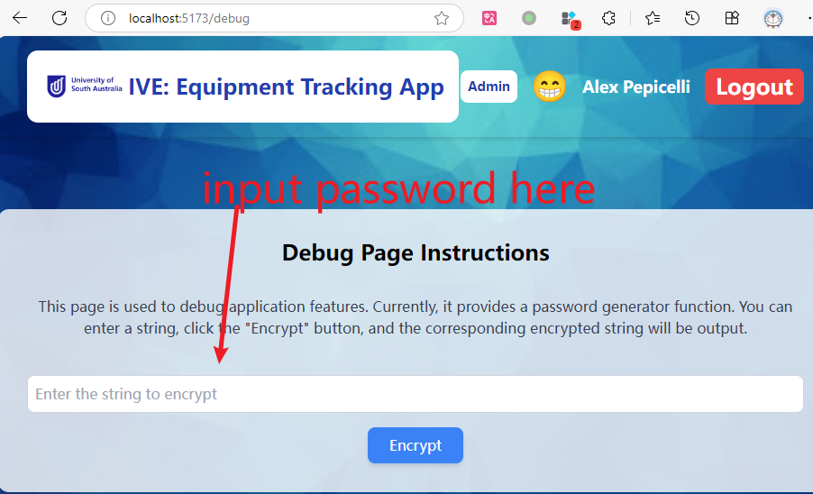
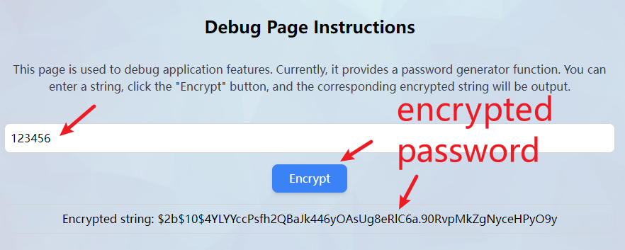
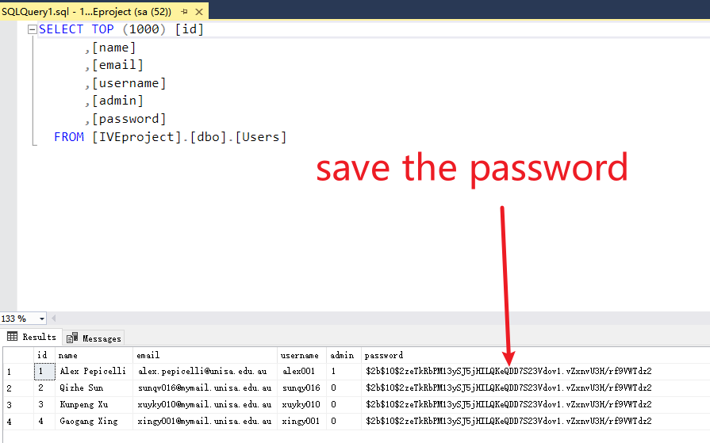

# React + Vite

This template provides a minimal setup to get React working in Vite with HMR and some ESLint rules.

Currently, two official plugins are available:

- [@vitejs/plugin-react](https://github.com/vitejs/vite-plugin-react/blob/main/packages/plugin-react/README.md) uses [Babel](https://babeljs.io/) for Fast Refresh
- [@vitejs/plugin-react-swc](https://github.com/vitejs/vite-plugin-react-swc) uses [SWC](https://swc.rs/) for Fast Refresh

## Expanding the ESLint configuration

If you are developing a production application, we recommend using TypeScript and enable type-aware lint rules. Check out the [TS template](https://github.com/vitejs/vite/tree/main/packages/create-vite/template-react-ts) to integrate TypeScript and [`typescript-eslint`](https://typescript-eslint.io) in your project.


# How to run this project?

## 1. Import database data to MSSQL server.
- Open SQL Server Management Studio (SSMS).
- Connect to your SQL Server instance.
- Create database named "IVEproject".
- Import data from files to database "IVEproject".
  - `database/Equipments.csv`
  - `database/Users.csv`
    - All the passwords are "123456".

## 2. Config database connection string.
- Open `server.cjs`.
- Change `server` config to your server name, set username and password.

## 3. Start backend server
```
node server.cjs
```
## 4. Start frontend server.
```
npm run dev
```

## 5. Debug page - how to set password ?

- URL: `/debug`
- This page is used to generate crypt password for the Users table.



- Click "Generate" button, then you will see the password in the input field.



- Copy the password and paste it to the Users table in the database.

